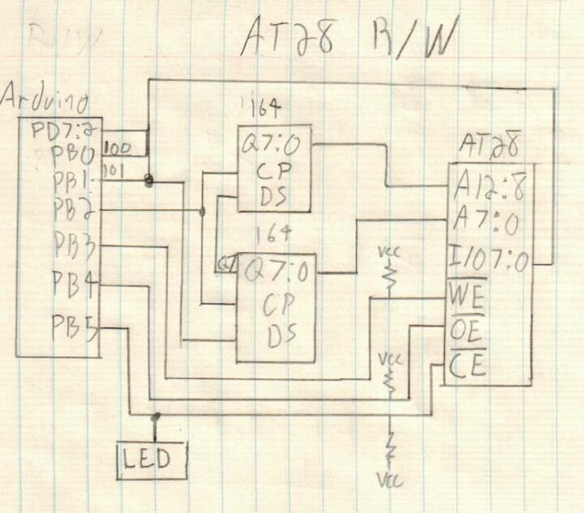

# Writing to a AT28 EEPROM from a modern environment

In this recipe, we'll build ourselves an ad-hoc EEPROM holder which is designed
to be driven from an Arduino Uno.

## Gathering parts

* An Arduino Uno
* A AT28C64B
* 2 '164 shift registers
* Sockets, header pins, proto board, etc.
* [avra][avra] (will soon rewrite to Collapse OS' ASM)
* avrdude to send program to Arduino

## Schema

This is a rather simple circuit which uses 2 chained '164 shift register to
drive the AT28 address pins and connects CE, WE, OE and the data pins directly
to the Arduino. Pins have been chosen so that the protoboard can plug directly
on the Arduino's right side (except for VCC, which needs to be wired).

PD0 and PD1 are not used because they're used for the UART.

AT28 selection pins are pulled up to avoid accidental writes due to their line
floating before Arduino's initialization.

I've put 1uf decoupling caps next to each IC.

## Software

The software in at28wr.asm listens to the UART and writes every byte it receives
to the AT28, starting at address 0. It expects tty-escaped content (see
`/tools/ttysafe`).

After having written the byte, it re-reads it from the EEPROM and spits it back
to the UART, tty-escaped.

## Usage

After you've build and sent your binary to the Arduino with `make send`, you
can send your (tty-safe!) content to your EEPROM using `/tools/pingpong`.

[avra]: http://avra.sourceforge.net/
