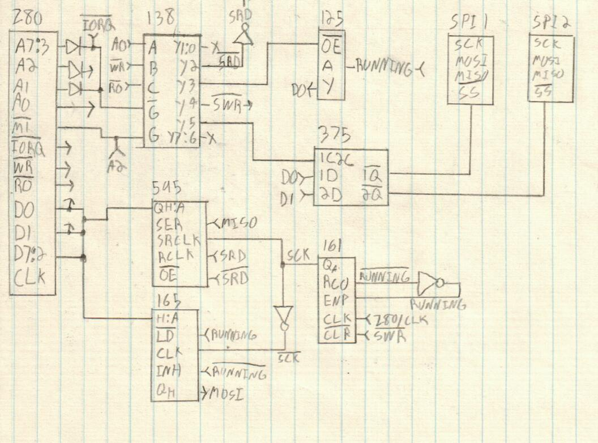

# Accessing a MicroSD card

SD cards are great because they are accessible directly. No supporting IC is
necessary. The easiest way to access them is through the SPI protocol.

Due to the way IO works in z80, implementing SPI through it as a bit awkward:
You can't really keep pins high and low on an IO line. You need some kind of
intermediary between z80 IOs and SPI.

There are many ways to achieve this. This recipe explains how to build your own
hacked off SPI relay for the RC2014. It can then be used with the SD Card
subsystem (B420) to drive a SD card.

## Gathering parts

* A RC2014 Classic
* A MicroSD breakout board. I use Adafruit's.
* A proto board + header pins with 39 positions so we can make a RC2014 card.
* Diodes, resistors and stuff
* 40106 (Inverter gates)
* 74xx138 (Decoder)
* 74xx375 (Latches)
* 74xx125 (Buffer)
* 74xx161 (Binary counter)
* 74xx165 (Parallel input shift register)
* 74xx595 (Shift register)

## Building the SPI relay

The schematic above works well with the SD Card subsystem (B420). Of course,
it's not the only possible design that works, but I think it's one of the most
straighforwards.

This relay communicates through the z80 bus with 2 ports, `DATA` and `CTL` and
allows up to 4 devices to be connected to it at once, although only one device
can ever be active at once. This schema only has 2 (and the real prototype I've
built from it), but the '375 has room for 4. In this schema, `DATA` is port 4,
`CTL` is port `5`.

We activate a device by sending a bitmask to `CTL`, this will end up in the
'375 latches and activate the `SS` pin of one of the device, or deactivate them
all if `0` is sent.

You then initiate a SPI exchange by sending a byte to send to the `DATA` port.
This byte will end up in the '165 and the '161 counter will be activated,
triggering a clock for the SPI exchange. At each clock, a bit is sent to `MOSI`
from the '161 and received from `MISO` into the '595, which is the byte sent to
the z80 bus when we read from `DATA`.

When the '161 is wired to the system clock, as it is in the schema, two `NOP`s
are a sufficient delay between your `DATA` write and subsequent `DATA` read.

However, if you build yourself some kind of clock override and run the '161 at
something slower than the system clock, those 2 `NOP`s will be too quick. That's
where that '125 comes into play. When reading `CTL`, it spits `RUNNING` into
`D0`. This allows you to know when the result of the SPI exchange is ready to be
fetched. Make sure you `AND` away other bits, because they'll be garbage.

The '138 is to determine our current IORQ mode (`DATA`/`CTL` and `WR/RO`), the
'106 is to provide for those `NOT`s sprinkled around.

Please note that this design is inspired by [this design][inspiration].

Advice 1: Make `SCK` polarity configurable at all 3 endpoints (the 595, the 165
and SPI connector). Those jumpers will be useful when you need to mess with
polarity in your many tinkering sessions to come.

Advice 2: Make input `CLK` override-able. SD cards are plenty fast enough for
us to use the system clock, but you might want to interact with devices that
require a slower clock.

## Building your binary

The binary built in the base recipe doesn't have SDC drivers. You'll need to
assemble a binary with those drivers. To do so, you'll modify the xcomp unit
of the base recipe. Look at `xcomp.fs`, you'll see that we load a block. That's
our xcomp block (likely, B599). Open it.

First, we need drivers for the SPI relay. This is done by declaring `SPI_DATA`
and `SPI_CTL`,  which are respectively `4` and `5` in our relay design.

You also need to tell the SDC subsystem which SPI device to activate by defining
the `SDC_DEVID` (1, 2, 4, 8 for device 0, 1, 2 or 3)

You can then load the driver with `616 LOAD`. This driver provides
`(spix)` and `(spie)` which are then used in the SDC driver.

The SDC driver is at B420. It gives you a load range. This means that what
you need to insert in `xcomp` will look like:

    423 436 LOADR  ( sdc )

You also need to add `BLK$` to the init sequence.

Build it (run `make pack` in `cvm/` first to ensure an up-to-date blkfs) and
write it to EEPROM.

## Testing in the emulator

The RC2014 emulator includes SDC emulation. You can attach a SD card image to
it by invoking it with a second argument:

    ../../../emul/hw/rc2014/classic os.bin ../../../cvm/blkfs

You will then run with a SD card having the contents from `/blk`.

## Usage

First, the SD card needs to be initialized

    SDC$

If there is no error message, we're fine. Then, we need to hook `BLK@*` and
`BLK!*` into the SDC driver:

    ' SDC@ BLK@* !
    ' SDC! BLK!* !

And thats it! You have full access to disk block mechanism:

    105 LOAD
    BROWSE

(at this moment, the driver is a bit slow though...)

## How do I fill my SD card with Collapse OS' FS?

Very easy. You see that `/cvm/blkfs` file? You dump it to your raw device.
For example, if the device you get when you insert your SD card is `/dev/sdb`,
then you type `cat emul/blkfs | sudo tee /dev/sdb > /dev/null`.

[inspiration]: https://www.ecstaticlyrics.com/electronics/SPI/fast_z80_interface.html
