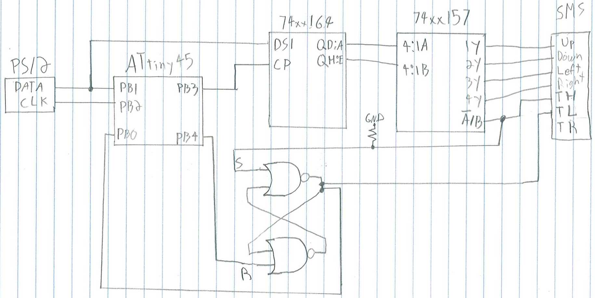

# PS/2 keyboard on the SMS

Using the shell with a D-pad on the SMS is doable, but not fun at all! We're
going to build an adapter for a PS/2 keyboard to plug as a SMS controller.

The PS/2 logic will be the same as the [RC2014's PS/2 adapter][rc2014-ps2] but
instead of interfacing directly with the bus, we interface with the SMS'
controller subsystem (that is, what we poke on ports `0x3f` and `0xdc`).

How will we achieve that? A naive approach would be "let's limit ourselves to
7bit ASCII and put `TH`, `TR` and `TL` as inputs". That could work, except that
the SMS will have no way reliable way (except timers) of knowing whether polling
two identical values is the result of a repeat character or because there is no
new value yet.

On the AVR side, there's not way to know whether the value has been read, so we
can't to like on the RC2014 and reset the value to zero when a `RO` request is
made.

We need communication between the SMS and the PS/2 adapter to be bi-directional.
That bring the number of usable pins down to 6, a bit low for a proper character
range. So we'll fetch each character in two 4bit nibbles. `TH` is used to select
which nibble we want.

`TH` going up also tells the AVR MCU that we're done reading the character and
that the next one can come up.

As always, the main problem is that the AVR MCU is too slow to keep up with the
rapid z80 polling pace. In the RC2014 adapter, I hooked `CE` directly on the
AVR, but that was a bit tight because the MCU is barely fast enough to handle
this signal properly. I did that because I had no proper IC on hand to build a
SR latch.

In this recipe, I do have a SR latch on hand, so I'll use it. `TH` triggering
will also trigger that latch, indicating to the MCU that it can load the next
character in the '164. When it's done, we signal the SMS that the next char is
ready by resetting the latch. That means that we have to hook the latch's output
to `TR`.

Nibble selection on `TH` doesn't involve the AVR at all. All 8 bits are
pre-loaded on the '164. We use a 4-channel multiplexer to make `TH` select
either the low or high bits.

## Gathering parts

* A SMS that can run Collapse OS
* A PS/2 keyboard. A USB keyboard + PS/2 adapter should work, but I haven't
  tried it yet.
* A PS/2 female connector. Not so readily available, at least not on digikey. I
  de-soldered mine from an old motherboard I had laying around.
* A SMS controller you can cannibalize for the DB-9 connection. A stock DB-9
  connector isn't deep enough.
* ATtiny85/45/25 (main MCU for the device)
* 74xx164 (shift register)
* 74xx157 (multiplexer)
* A NOR SR-latch. I used a 4043.
* Proto board, wires, IC sockets, etc.

## Historical note

As I was building this prototype, I was wondering how I would debug it. I could
obviously not hope for it to work as a keyboard adapter on the first time, right
on port A, driving the shell. I braced myself mentally for a logic analyzer
session and some kind of arduino-based probe to test bit banging results.

And then I thought "why not use the genesis?". Sure, driving the shell with the
D-pad isn't fun at all, but it's possible. So I hacked myself a temporary debug
kernel with a "a" command doing a probe on port B. It worked really well!

It was a bit less precise than logic analyzers and a bit of poking-around and
crossing-fingers was involved, but overall, I think it was much less effort
than creating a full test setup.

There's a certain satisfaction to debug a device entirely on your target
machine...

## Building the PS/2 interface

The PS/2-to-AVR part is identical to the rc2014/ps2 recipe. Refer to this
recipe.

We control the '164 from the AVR in a similar way to what we did in rc2014/ps2,
that is, sharing the DATA line with PS/2 (PB1). We clock the '164 with PB3.
Because the '164, unlike the '595, is unbuffered, no need for special RCLK
provisions.

Most of the wiring is between the '164 and the '157. Place them close. The 4
outputs on the '157 are hooked to the first 4 lines on the DB-9 (Up, Down, Left,
Right).

In my prototype, I placed a 1uf decoupling cap next to the AVR. I used a 10K
resistor as a pull-down for the TH line (it's not always driven).

If you use a 4043, don't forget to wire EN. On the '157, don't forget to wire
~G.

The code expects a SR-latch that works like a 4043, that is, S and R are
triggered high, S makes Q high, R makes Q low. R is hooked to PB4. S is hooked
to TH (and also the A/B on the '157). Q is hooked to PB0 and TL.

## Building the binary

We start with the base recipe and add a few things:

1. at the top: `SYSVARS 0x72 + CONSTANT PS2_MEM`
2. After VDP load: `641 LOAD : (ps2kc) (ps2kcB) ;` (that binds us to port B)
3. Right after: `411 414 LOADR` (that gives us `(key)`)
4. After `VDP$`: `PS2$`.

Rebuild, send to SMS, then run with your keyboard interface plugged to PortB.
It should mostly work. There are still a few glitches to iron out...

[rc2014-ps2]: ../rc2014/ps2
